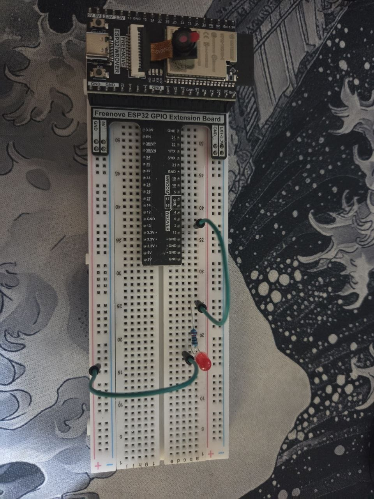

# LED BLINK - ESP32

Blink project using the ESP32 built-in LED at 5 second intervals.

---

## Description

This project uses the ESP32's internal pin (`LED_BUILTIN = 2`) to make an LED blink continuously, staying on for 5 seconds and off for 5 seconds.

---

## Circuit

Components used: 1 LED | 1 x 220 ohm resistor | 2 jumper wires



---

## Demo

[Watch the circuit in action (local video)](video_2026-05-09_18-47-14.mp4)

[Watch on YouTube](https://youtube.com/shorts/HFh4V4sFz3Q?feature=share)

---

## Code

```cpp
#define LED_BUILTIN 2

void setup() {
  // Initialize LED_BUILTIN pin as OUTPUT
  pinMode(LED_BUILTIN, OUTPUT);
}

void loop() {
  digitalWrite(LED_BUILTIN, HIGH); // Turn LED on (HIGH = high voltage)
  delay(5000);                     // Wait 5 seconds
  digitalWrite(LED_BUILTIN, LOW);  // Turn LED off (LOW = low voltage)
  delay(5000);                     // Wait 5 seconds
}
```

---

## How it works

| State        | Pin  | Duration |
|--------------|------|----------|
| LED on       | HIGH | 5000 ms  |
| LED off      | LOW  | 5000 ms  |

> **Note:** On the ESP32, the built-in LED is active on `HIGH`, unlike some Arduino boards where it is active on `LOW`.

---

## Hardware used

- ESP32 (any variant with a built-in LED on pin 2)

## Software used

- Arduino IDE
- ESP32 library for Arduino
