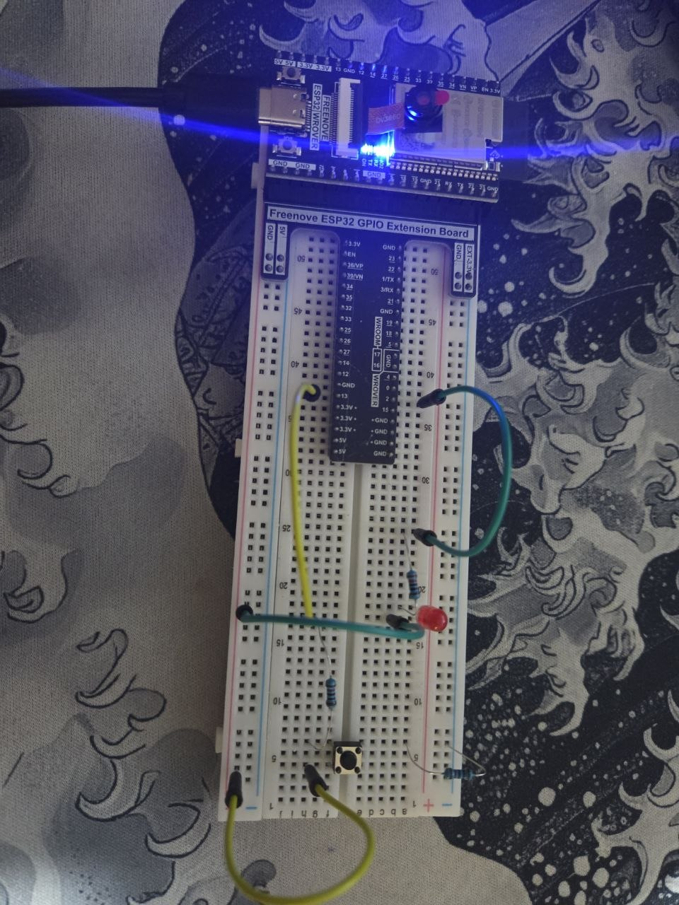

# LED BUTTON - ESP32

LED control project using a push button on the ESP32 with a Pull-up circuit configuration.

---

## Description

This project uses pin 2 of the ESP32 for the LED and pin 13 for the button. While the button is pressed, the LED turns on. When released, the LED turns off.

---

## Circuit

Components used: 1 LED | 1 x 220 ohm resistor | 2 x 10 ohm resistors | 4 jumper wires | 1 push button



---

## Demo

[Watch on YouTube](https://youtube.com/shorts/q_0D8Xe3NS8?feature=share)

---

## Code

```cpp
#define PIN_LED 2     // LED pin on ESP32
#define PIN_BUTTON 13 // Button pin on ESP32

void setup() {
  pinMode(PIN_LED, OUTPUT);   // LED as signal output
  pinMode(PIN_BUTTON, INPUT); // Button as signal input
}

void loop() {
  // If the button is pressed (reads LOW in Pull-up circuit)
  if (digitalRead(PIN_BUTTON) == LOW) {
    digitalWrite(PIN_LED, HIGH); // Turn LED on
  } else {
    digitalWrite(PIN_LED, LOW);  // Turn LED off
  }
}
```

---

## How it works

| Button state | Reading | LED state |
|--------------|---------|-----------|
| Pressed      | LOW     | On        |
| Released     | HIGH    | Off       |

> **Note:** The circuit uses a Pull-up configuration, where the button reads `LOW` when pressed and `HIGH` when released.

---

## Hardware used

- ESP32
- Push button
- LED
- 1 x 220 ohm resistor
- 2 x 10 ohm resistors
- 4 jumper wires

## Software used

- Arduino IDE
- ESP32 library for Arduino
