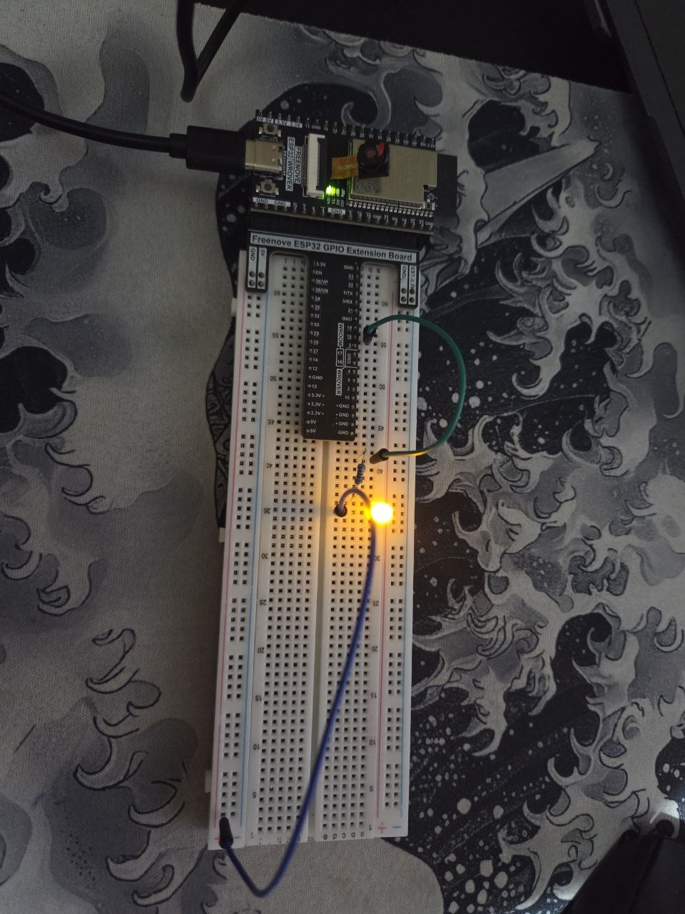

# LED BREATH - ESP32

LED Breath project using 1 LEDs controlled by the ESP32, creating a back-and-forth animation effect.

---

## Description

This project controls 1 LED bar using pins 18 of the ESP32. The LEDs light up one slowly and shutsdown slowly

---

## Circuit

Components used: 1 LED | 1 x 220 ohm resistors | 2 jumper wires

---

## Demo

[Watch on YouTube](https://youtube.com/shorts/D2MlcbxRvMk)

---

## Software used

- Arduino IDE
- ESP32 library for Arduino
