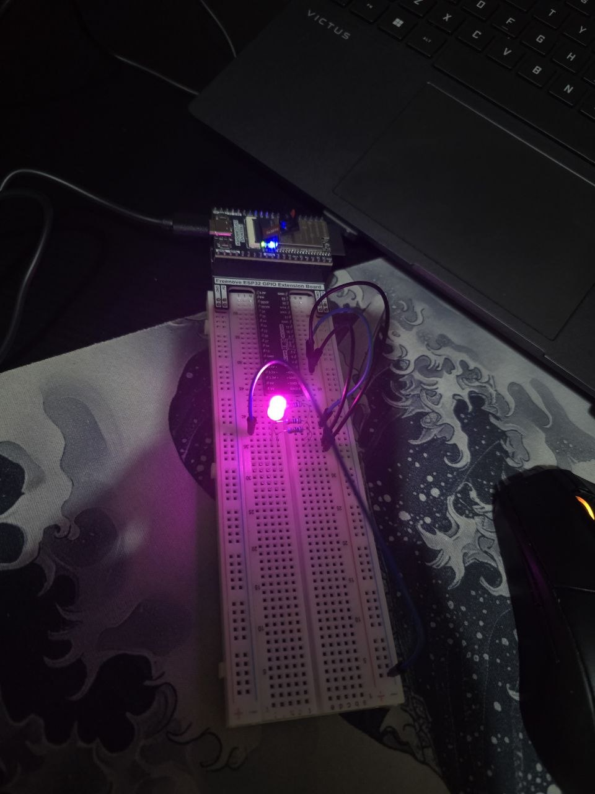

# LED RGB & RGB RAINBOW - ESP32

LED RGB project using 1 LEDs controlled by the ESP32.

---

## Description

This project controls 1 RGB LED using the ESP32.

---

## Circuit

Components used: 1 LED | 3 x 220 ohm resistors | 2 jumper wires

---

## Demo

[Watch on YouTube RGB Random](https://www.youtube.com/shorts/Q0ApMd1pYaE)
[Watch on YouTube RGB Rainbow](https://youtu.be/XbPS4ZO0S6Q)

---

## Software used

- Arduino IDE
- ESP32 library for Arduino
