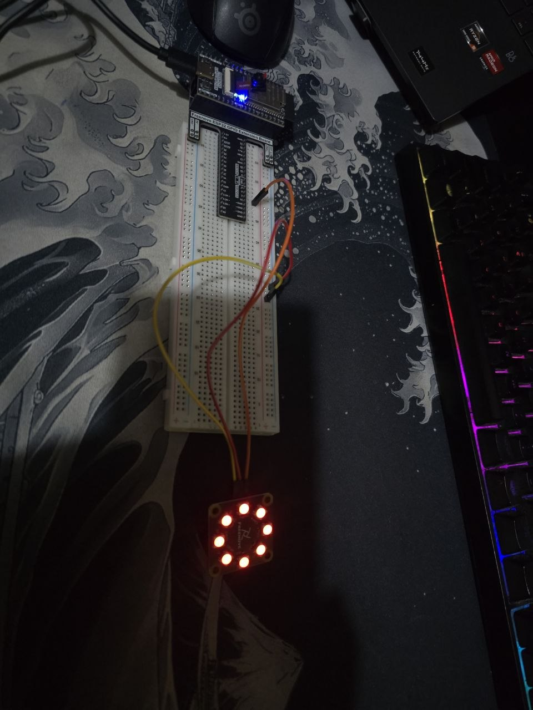

# LED Pixel - ESP32

LED Pixel project using 1 LED Pixel controlled by the ESP32.

---

## Description

This project controls 1 Led Pixel using the ESP32.

---

## Circuit

Components used: 1 LED Pixel | 3 F/M jumper wires

---

## Demo

[Watch on YouTube Led Pixel](https://youtu.be/qMiD7D8Yor0)

---

## Software used

- Arduino IDE
- ESP32 library for Arduino
